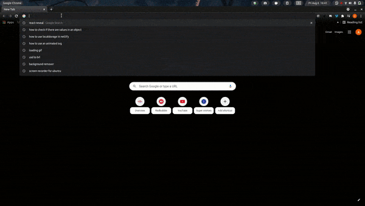

<h1 align="center">
  
</h1>

	
	
	
	
	
	

 
	Minimal and Easy to use.  
	TaskGround is task manager site, with great focus on multitasking and fast creation of rooms.

 <a href="#features">Features</a> •
 <a href="#gear-technologies">Technologies</a> •
 <a href="#computer-instalation">Instalation</a> •
 <a href="#handshake-author">Author</a> 

## **Demonstration**

## **Features**

- [x] User Sing in
- [x] Create and Delete Room
- [x] Create, Delete and Check Task as done

## :gear: **Technologies**  

* [React](https://pt-br.reactjs.org/)
* [TypeScript](https://www.typescriptlang.org/)
* [Style Components](https://styled-components.com/)
* [Firebase](https://firebase.com/)

## :computer: **Instalation**

npm start

## :handshake: **Author**
	
Created by ✌ <a href="github.com/SitaGomes">Arthur Sita Gomes</a>. Come chat with me!

<a href="https://twitter.com/ArthurSitaGomes">
	
	
<a href="https://www.linkedin.com/in/arthur-sita-gomes-3683221b3/">
	
